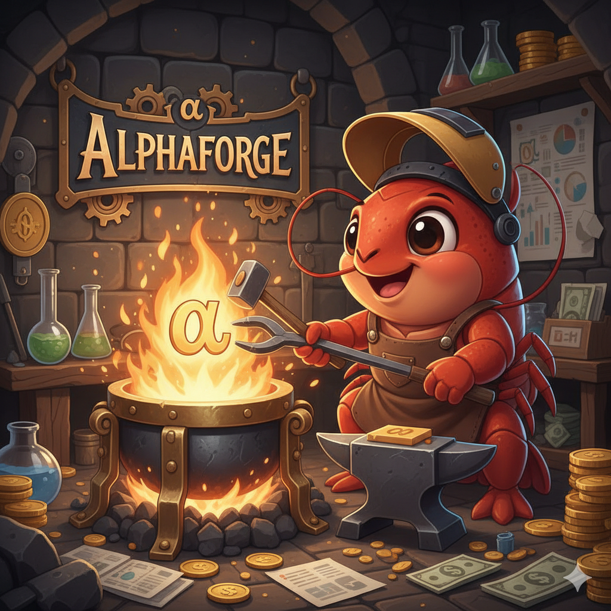

<p align="center">
  
</p>

<h1 align="center">AlphaForge</h1>

<p align="center">
  <strong>End-to-End Factor-Driven Quant System for Crypto Perpetuals</strong>
</p>

<p align="center">
  
  
  
</p>

<p align="center">
  Factor Mining → Statistical Evaluation → Combo Search → Walk-Forward Backtest → Paper Trade → Live
</p>

---

## What is AlphaForge?

A **production-grade** quantitative trading framework for crypto perpetual contracts. Unlike toy backtesting scripts, AlphaForge covers the full lifecycle with a corrected execution model:

```
Your Factors ──→ Rolling IC / FDR Evaluation ──→ Factor Library
                                                       ↓
                                            Greedy Combo Search
                                                       ↓
              Walk-Forward Backtest ──→ Paper Trade ──→ Live
              (next-bar-open, funding fee,
               liquidation, slippage)
```

**Bring your own alpha.** The framework handles everything else.

## Why AlphaForge?

| Problem | How AlphaForge Solves It |
|---------|-------------------------|
| Backtests look great, live trading loses money | **Corrected engine**: next-bar-open execution, funding fees, liquidation, slippage |
| Sharpe ratio inflated 5-10x | **Honest metrics**: daily-frequency Sharpe, Newey-West t-stats, FDR correction |
| Combining factors is guesswork | **Greedy combo search**: auto-find optimal combination by forward-stepping IC |
| No systematic factor evaluation | **Factor pipeline**: register → evaluate → pass/fail FDR → auto-register |
| Walk-forward is painful | **Built-in**: expanding window train/test split with OOS evaluation |

## Architecture

```
src/
├── factor_pipeline/
│   ├── factors/               # Your factor implementations (pluggable)
│   ├── evaluator.py           # Rolling IC, FDR, Newey-West
│   ├── combo_search.py        # Greedy forward-step search
│   ├── registry.py            # Factor auto-discovery via decorator
│   └── pipeline.py            # CLI orchestrator
├── backtest.py                # Corrected backtest engine
├── strategy.py                # Config-driven signal generation
├── data_fetcher.py            # OKX + FRED + CryptoPanic
├── data_store.py              # Local data management
└── risk_guardrails.py         # Position limits, drawdown stops

scripts/
├── realtime_collector.py      # Multi-source data collector
├── paper_trade.py             # Paper trading integration
└── backfill_alternative_data.py
```

## Quick Start

```bash
git clone https://github.com/warren618/AlphaForge.git
cd AlphaForge
pip install -r requirements.txt
cp .env.example .env  # fill in your API keys
```

### 1. Write Your Factors

```python
# src/factor_pipeline/factors/my_factors.py
from src.factor_pipeline.registry import register_factor

@register_factor("my_momentum")
def my_momentum(df):
    return df["close"].pct_change(14)
```

### 2. Evaluate

```bash
python -m src.factor_pipeline list                          # list registered factors
python -m src.factor_pipeline eval my_momentum --days 90    # rolling IC + FDR
python -m src.factor_pipeline combo --method greedy --top 5 # find best combo
```

### 3. Backtest

```bash
python run_backtest.py --config strategies/examples/momentum_example.yaml --days 90
python run_backtest.py --config strategies/examples/momentum_example.yaml --walk-forward
```

## Backtest Engine — Corrected Execution Model

Built after a painful audit that invalidated months of backtesting results.

| Feature | Naive Approach | AlphaForge |
|---------|---------------|------------|
| Execution price | Close price (look-ahead) | **Next-bar open** |
| Sharpe frequency | Annualized from 5min bars | **Daily-frequency** |
| Funding fees | Ignored | **8h funding rate deducted** |
| Liquidation | Ignored | **Simulated with maintenance margin** |
| Position sizing | Fixed notional | **Fixed-fractional** |
| Multiple testing | No correction | **FDR (Benjamini-Hochberg)** |
| IC t-statistic | Standard t-test | **Newey-West (HAC)** |

## Factor Pipeline

The pipeline supports any factor you write. Just decorate with `@register_factor`:

| Category | Description |
|----------|-------------|
| **Momentum** | Trend-following, breakout timing |
| **Mean Reversion** | Statistical deviation, exhaustion patterns |
| **Volume/Price** | Order flow, volume profile analysis |
| **Microstructure** | Funding rate, open interest dynamics |
| **Cross-Asset** | Inter-market correlation, macro sensitivity |
| **Derivatives** | Options flow, basis, implied volatility |
| **On-Chain** | Positioning, leverage metrics |
| **Macro** | Economic indicators, sentiment |

## Roadmap

- [ ] Multi-exchange support (Binance, Bybit)
- [ ] ML-based factor combination
- [ ] Real-time factor dashboard
- [ ] Slippage model calibration from live fills

## License

MIT

---

<sub>Built by <a href="https://github.com/warren618">@warren618</a> — HKU MSc CS (Financial Computing)</sub>
